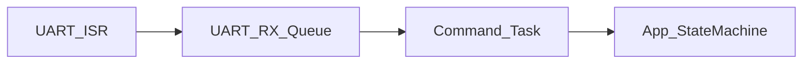
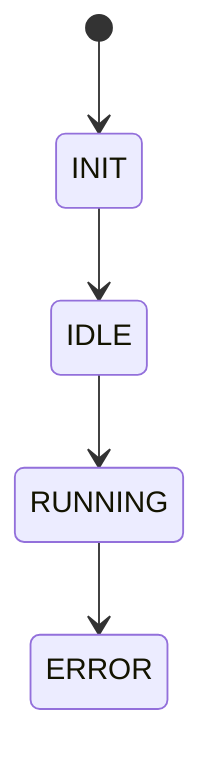

# Project: Firmware System Design Assistant

I want to build an app that helps embedded/firmware developers transform messy feature requirements into a structured firmware/system design.

The core problem:
When receiving a new feature requirement, firmware developers often do not know where to start:
- What are the inputs/outputs?
- What are the events?
- What states exist?
- How should responsibilities be divided?
- What modules/subsystems are needed?
- What RTOS tasks are needed?
- What queues/events/synchronization are needed?
- What failure modes should be considered?
- What diagrams should be drawn first?

The app should guide the user through a repeatable firmware feature design checklist and gradually generate a draft architecture, diagrams, and design document.

---

# Core Idea

The app is not just a diagram tool.

It is a guided firmware/system design assistant.

Workflow:

1. User creates a new feature/design.
2. User enters a rough requirement.
3. App guides user through structured checklist sections:
   - Feature summary
   - System purpose
   - Inputs / Outputs
   - Events
   - States
   - Responsibility decomposition
   - Interactions & data flow
   - RTOS / concurrency design
   - Resource ownership
   - Failure analysis
   - Layered architecture
   - Debuggability
   - Implementation planning
4. User fills answers gradually.
5. App generates:
   - Markdown design document
   - Mermaid architecture diagram
   - Mermaid state machine diagram
   - RTOS task table
   - Module/responsibility table
   - AI review prompts
6. User can edit answers and regenerate outputs.

---

# MVP Scope

Implement a local-first web app.

MVP must include:

## Pages / Views

### 1. Dashboard
- List existing designs
- Create new design
- Open/edit existing design

### 2. Design Editor
- Left side: checklist sections
- Main area: form fields for selected section
- Right side: live preview output

### 3. Generated Outputs
- Markdown design document
- Mermaid flowchart
- Mermaid state diagram
- RTOS task table
- Risk/failure checklist

---

# Data Model

Create a design object like:

```ts
type FirmwareDesign = {
  id: string;
  title: string;
  requirement: string;
  createdAt: string;
  updatedAt: string;

  featureSummary: {
    summary: string;
    purpose: string;
    constraints: string[];
  };

  systemPurpose: {
    shouldDo: string[];
    shouldNotDo: string[];
    successCriteria: string[];
    failureCriteria: string[];
    boundaries: string[];
  };

  io: {
    inputs: string[];
    outputs: string[];
  };

  events: {
    name: string;
    source: string;
    trigger: string;
    frequency?: string;
    latencySensitive?: boolean;
  }[];

  states: {
    name: string;
    description: string;
    transitions: {
      event: string;
      targetState: string;
      action?: string;
    }[];
  }[];

  responsibilities: {
    responsibility: string;
    module: string;
    notes?: string;
  }[];

  interactions: {
    from: string;
    to: string;
    mechanism:
      | "queue"
      | "event"
      | "notification"
      | "callback"
      | "shared_memory"
      | "direct_call"
      | "other";
    data: string;
    notes?: string;
  }[];

  rtos: {
    tasks: {
      name: string;
      responsibility: string;
      priority: "high" | "medium" | "low";
      type:
        | "periodic"
        | "event-driven"
        | "background"
        | "worker";
      trigger: string;
      mayBlock: boolean;
      notes?: string;
    }[];
    synchronization: string[];
    timingRisks: string[];
  };

  ownership: {
    resource: string;
    owner: string;
    accessRules: string;
  }[];

  failureModes: {
    scenario: string;
    impact: string;
    recovery: string;
  }[];

  layers: {
    application: string[];
    service: string[];
    driver: string[];
    halBsp: string[];
  };

  debugging: {
    logs: string[];
    traces: string[];
    observability: string[];
  };

  implementationPlan: {
    milestones: string[];
    apis: string[];
    tests: string[];
  };
};
```

---

# Checklist Sections

Use this checklist as the app structure.

---

## 0. Feature Summary

### Fields
- Feature summary
- Why does this feature exist?
- Constraints:
  - Real-time
  - Memory
  - CPU
  - Power
  - Safety/reliability
  - Scalability

---

## 1. System Purpose

### Fields
- What should the system do?
- What should the system not do?
- Success criteria
- Failure criteria
- Feature boundaries

---

## 2. Inputs / Outputs

### Fields
- Inputs
- Outputs

---

## 3. Events

### Fields
- Event name
- Source
- Trigger
- Frequency
- Latency-sensitive?

---

## 4. States

### Fields
- State name
- Description
- Transitions
- Triggering events
- Target states
- Actions

---

## 5. Responsibility Decomposition

### Fields
- Responsibility
- Candidate module/subsystem
- Notes

---

## 6. Interactions & Data Flow

### Fields
- From
- To
- Mechanism
- Data
- Notes

---

## 7. RTOS / Concurrency Design

### Fields
- Task name
- Responsibility
- Priority
- Task type
- Trigger
- May block?
- Synchronization
- Timing risks

---

## 8. Resource Ownership

### Fields
- Resource
- Owner
- Access rules

---

## 9. Failure Analysis

### Fields
- Failure scenario
- Impact
- Recovery strategy

---

## 10. Layered Architecture

### Fields
- Application layer modules
- Service layer modules
- Driver layer modules
- HAL/BSP layer modules

---

## 11. Debuggability

### Fields
- Logs
- Trace points
- Observability points

---

## 12. Implementation Planning

### Fields
- Milestones
- APIs
- Tests

---

# Generated Outputs

Implement generators.

---

## 1. Markdown Design Document

Generate a full markdown document from the design object.

---

## 2. Mermaid Architecture Flowchart

Generate Mermaid like:



Use interactions and RTOS tasks.

---

## 3. Mermaid State Diagram

Generate Mermaid like:



Use states and transitions.

---

## 4. RTOS Task Table

Generate markdown table:

| Task | Responsibility | Priority | Type | Trigger | May Block |
|------|----------------|----------|------|----------|-----------|

---

## 5. Risk Review

Generate checklist:
- Race condition risk
- Queue overflow risk
- Priority inversion risk
- Shared ownership risk
- Missing failure recovery

---

# UI Requirements

Use a clean, simple interface.

Recommended stack:
- React
- TypeScript
- Tailwind CSS
- LocalStorage for MVP persistence
- Mermaid preview if possible

Important UX:
- Do not show all checklist fields at once.
- Show one section at a time.
- Add progress indicator.
- Allow incomplete designs.
- Allow user to gradually improve.
- Live preview should update as data changes.
- Export markdown button.

---

# Implementation Tasks

Please implement:

1. Project structure
2. TypeScript types
3. Sample initial design
4. LocalStorage persistence
5. Dashboard page
6. Design editor page
7. Checklist section navigation
8. Form components for each section
9. Markdown generator
10. Mermaid flowchart generator
11. Mermaid state diagram generator
12. RTOS task table generator
13. Export markdown feature

---

# Design Goal

The goal is not to make a perfect architecture automatically.

The goal is to help the user think clearly and avoid getting lost when starting from a feature requirement.

This app should act like a structured thinking assistant for firmware/system design.